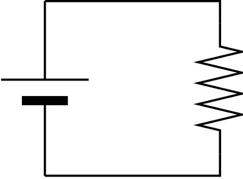

### __問題文__
***
電気回路の勉強で、まず初めに習うのは「オームの法則」でしょう。



上記の抵抗回路において、オームの法則は、
$$
（電圧）＝（抵抗）×（電流）
$$
という方程式で表されます。電気抵抗が一定ならば、電圧と電流が比例することがわかります。  
この問題では、抵抗と電流の値が与えられるので、電源の電圧を計算して求めるプログラムを作成してください。

<br>

### __入力される値__
***
$R,I$  

- 抵抗値 $R$ 、回路を流れる電流 $I$ がスペース区切りで与えられます。

<br>

### __制約__
***
$0 \leqq R \leqq 10^6, 0 \leqq I \leqq 10$

<br>

#### サンプルケース
***
||標準入力|出力|
|:-:|:-:|:-:|
|1|10 10|100|

<br>

#### 解答例
***

```python
R, I = map(int, input().split())
print(R*I)
```

電源電圧を求めるには、抵抗と電流を掛け算します。
