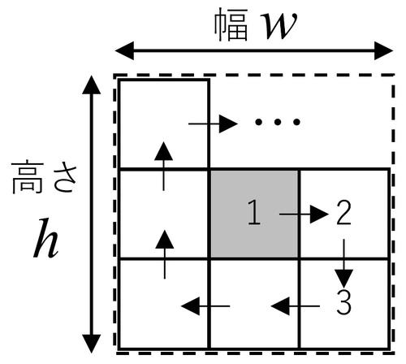

### __問題文__
***
1辺の長さが1の正方形のタイルをらせん状に並べます。

最初のタイルを含めてn枚のタイルを並べるとき、その外形となる長方形の縦・横のうち長い方の辺の長さを求めるプログラムを作成してください。
なお、正方形の場合は縦・横が同じなので、どちらを出力しても構いません。

<br>

### __入力される値__
***

```
n
```

- 最初のタイルを含めたタイルの枚数が与えられます。

<br>

### __制約__
***
$ 2 \leqq n \leqq 10000 $

<br>

#### サンプルケース
***
||標準入力|出力|
|:-:|:-:|:-:|
|1|5|3|
|2|9|3|

<br>

#### 解答例
***

```python
import math

n = int(input())

length = math.sqrt(n) # 平方根を求める
length = math.ceil(length) # 天井関数で整数に切り上げ

print(length)
```

らせん状にタイルを並べる場合、外形の長い方の辺は
- nが平方数$(1,4,9,...)$の場合、$\sqrt{n}$
- nが平方数ではない場合、$\lceil \sqrt{n} \rceil$

となります。  
なお、$\lceil x \rceil$は**天井関数**といい「$x$以上の最小の整数」を返します。  
【例】$\lceil 1.4 \rceil = 2 , \lceil 2 \rceil=2 , \lceil 2.001 \rceil=3$

よって、タイルの枚数の平方根を求め、それを天井関数で丸めたものが期待される出力になります。  

#### 菊地(2022) 解答コード
##### ちょっと余分なコードが入っています。。。(;'∀')
***

```python
import math

n = int(input())
root = int(math.sqrt(n))
if root * root == n:
    print(root)
else:
    print(root + 1)

```