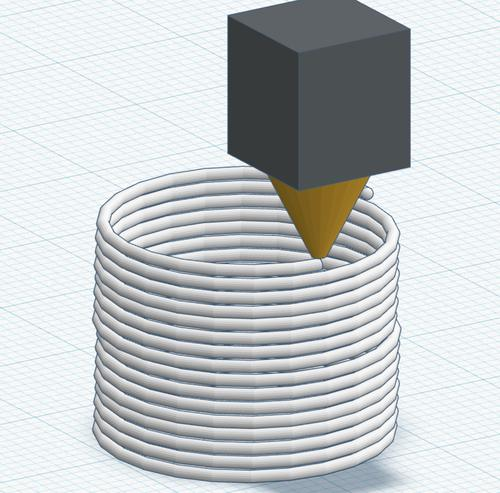

### __問題文__
***
3Dプリンターには色々な種類がありますが、学校で稼働している3DプリンターはFDM（熱溶解積層方式）と呼ばれる、ヘッド部分で材料を加熱し、溶けた材料を重ねていくことで立体を作ります。



図のように、壁の厚みが1層の円柱を出力しようとしています。次の情報を元に、出力にかかる時間を整数[秒]で求めてください。

・円柱の高さ： $H$ [cm]
・円の直径： $R$ [cm]
・ヘッドの動く速さ： $V$ [cm/s]
・積層厚み： $T$ [cm]

ただし、ヘッドを温める時間やトラベル（材料を押し出しせず、ヘッドだけ移動すること）など、出力以外の時間は無視できるものとします。

<br>

### __入力される値__
***

```
H R V T
```

<br>

### __制約__
***
$ 0.04 \leqq H \leqq 100 $
$ 0.1 \leqq R \leqq 100 $
$ 0.1 \leqq V \leqq 100 $
$ 0.04 \leqq T \leqq 100 $
ただし、円柱の高さは積層厚みで割り切れる値です。

<br>

### __期待される出力値__
***
出力にかかる時間を四捨五入し、整数値[秒]で解答してください。

<br>

#### サンプルケース
***
||標準入力|出力|
|:-:|:-:|:-:|
|1|1 3.18 2.5 0.04|99|
|2|12 3 2 0.4|141|

<br>

#### 解答例
***

```python
import math

H, R, V, T = list(map(float, input().split()))

layer_num = int(H / T) # 層数の計算
circum = math.pi * R # 円周の計算（円周率×直径）
sum_output = layer_num * circum # 総移動距離
time = int(sum_output / V) # 移動距離を速度で割って四捨五入

print(time)
```

問題をよく読み、1つずつ計算を進めていきましょう。計算過程はコメントの通りです。
</br>
</br>
</br>
#### 菊地(2022) 解答コード
***

```python
import math

def calculate_printing_time(H, R, V, T):
    # 総レイヤー数を計算
    total_layers = H / T

    # 円周の長さを計算
    circumference = math.pi * R

    # 総距離を計算
    total_distance = total_layers * circumference

    # 出力にかかる時間を計算
    printing_time = total_distance / V

    # 四捨五入して整数値で出力
    rounded_time = int(printing_time)

    return rounded_time

# 入力値を取得
H, R, V, T = map(float, input().split())

# 出力にかかる時間を計算
output_time = calculate_printing_time(H, R, V, T)

# 結果を出力
print(output_time)


```